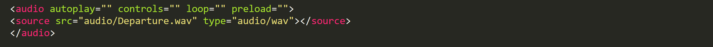
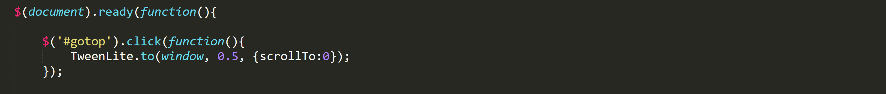
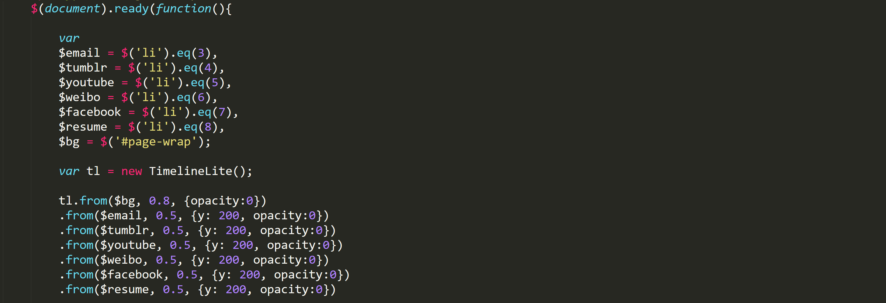
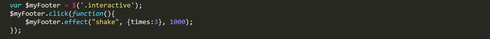

WebDev Final Project

http://sites.bxmc.poly.edu/~tonglinxu/HW/Week_12_Final/

Changes I made:

1. Cover Page & Slideshow
In my final project proposal, I said that I want to make a cover page and I also want to try slideshow. I ended up putting them together so it becomes a cover page with a slideshow. I used Bootstrap carousel to build this page.

2. Opening quotes
My new opening quotes can switch between two different quotes every 4 seconds. I used JavaScript and JQuery to toggle the quotes.

3. Background Music
I added a background music for the homepage using the audio tag in HTML.

4. Top Button
I added a button at the lower right corner on all pages that links to the top of the page. I used the TweenLite in GSAP to get the smooth scrolling effect.

5. Contact
I made an animated timeline using GSAP TimeLineLite. The list items fade in one by one. I also added my resume to the contact page, according to the feedback I got from midterm.

6. Game Download
I used to provide a Google Drive link to my first game, but then the users would be linked to a ugly Google Drive page. I changed the href of my anchor tag so that the users are now directly linked to the download page when they click on my game title.

7. Interactive footer

When users click on the footer under contact page, the footer would shake for 3 times. This interactivity is just for fun.

Future improvement:

1. I got a feedback from midterm presentation that I should have a dropdown menu in my navbar. I tried to do this for my final project, but each time when I added the dropdown menu, it broke my entire page layout. In the end, I gave up this idea because I did not have enough time to figure it out. If I had more time, I would like to fix this problem because I know that we have learned many ways to do it.

2. I used Bootstrap for my cover page, but I don't really like the way it looks because it looks like every other website. I want to find a way to personalize my cover page.

Problems I encounted and things I learned: 

1. When I tried to use GSAP TweenLite, I had a hard time making it scroll to top, because in the class example, we had it scroll to a specific element. I went through the TweenLite guide and in the end, I realized that it was much simpler than I thought.

2. I wanted to overlay my "enter site" button on top of my carousel, so I did some research on carousel overlay.

3. I learned about the shake effect in jQuery to add the shake effect to my footer.